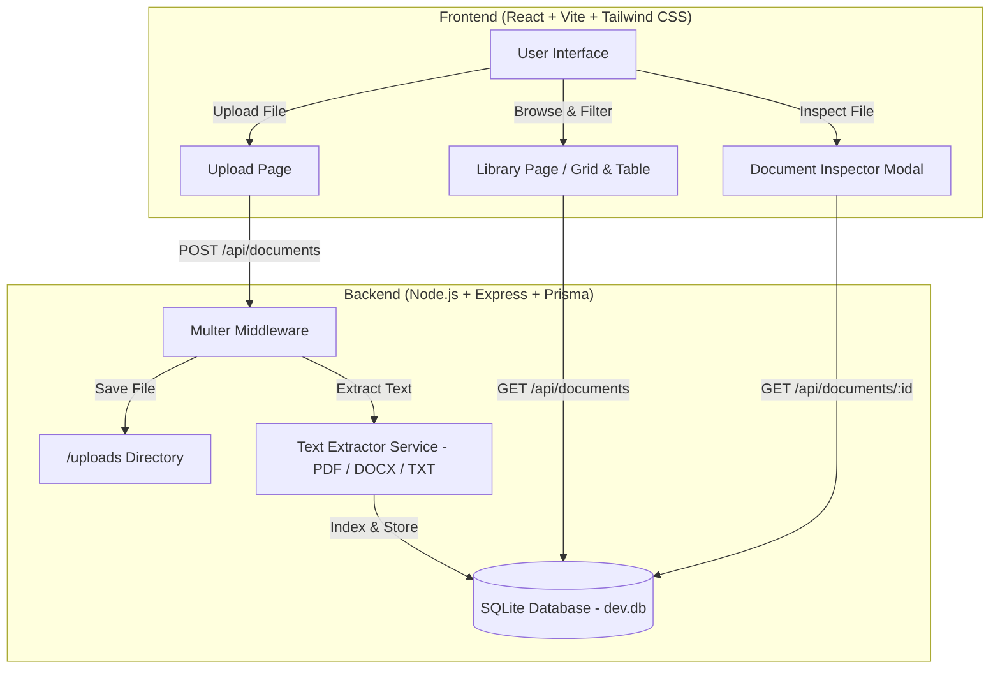

# 📌 ABOUT THIS PROJECT: Digital Library & Document Management System

> **A Comprehensive Guide & Project Overview for Team Members, Collaborators, & Evaluators**

---

## 🎯 Executive Overview

The **Digital Library & Document Management System** is a modern, responsive web application designed for storing, organizing, searching, and managing multi-format documents (PDFs, Microsoft Word `.docx`, Plain Text `.txt`, and Markdown `.md`).

It provides a centralized digital library where users can upload study materials, research papers, notes, and project documents, filter them by tags or search terms, inspect full extracted text, preview PDFs inline, and monitor library storage metrics.

---

## 💡 The Problem & Our Solution

| The Problem ❌ | Our Solution 💡 |
| :--- | :--- |
| **Document Disorganization**: Files scattered across folders makes finding notes and research papers difficult. | **Centralized Digital Library**: Upload, categorize, and organize all project documents in one place with grid and table views. |
| **Lack of Multi-Format Support**: Applications often only support PDFs or plain text. | **Multi-Format Ingestion**: Full support for PDF, DOCX, TXT, and Markdown (`.md`) files up to 50MB. |
| **No Text Extraction / Preview**: Opening files individually to read text is slow. | **Interactive Document Inspector**: Instant full-text extraction viewer, PDF frame reader, and original file downloader. |
| **No Tagging or Metadata**: Hard to group related project files together. | **Custom Tagging & Search**: Add custom tags, filter by file format, or search by filename and content. |

---

## 🚀 Key Features At A Glance

### 1. 📄 Multi-Format Document Management
- Upload support for **PDF, Microsoft Word (.docx), Plain Text (.txt), and Markdown (.md)**.
- Drag-and-drop or file selector upload with size validation (up to 50MB per file).
- Filename sanitization and secure local storage in `/uploads`.

### 2. ⚡ Automated Text Extraction & Indexing
- **PDF Page Tracking**: `pdf-parse` extracts full text and maps boundaries to page numbers.
- **Word Document Parsing**: `mammoth` extracts structured raw text from `.docx` files.
- **Direct Text Reader**: Plain text and Markdown files are indexed via UTF-8 text buffers.

### 3. 🔍 Search, Filter & Tagging Engine
- **Instant Search**: Search across filenames, tags, and document content.
- **Format Filter**: Quickly filter documents by PDF, DOCX, TXT, or MD.
- **Custom Tags**: Add and manage custom tags for efficient folder-less organization.

### 4. 👁️ Interactive Document Inspector
- **Full Text Reader**: View complete extracted text with line wrapping.
- **PDF Preview Window**: Embedded iframe for reading PDFs directly inside the app.
- **Metadata Editor**: Update descriptions, manage tags, and download original files.

### 5. 📊 Real-Time Analytics & System Health
- **Live Metrics Dashboard**: Visual cards showing total documents, disk storage consumed, document type breakdown, and recent uploads.
- **System Health Diagnostics**: Live database connectivity status and storage metrics.

---

## ⚙️ System Architecture & Data Flow



---

## 🛠️ Tech Stack & Technology Rationale

### **Frontend**
- **React + Vite + TypeScript**: High performance, strong typing, and fast development experience.
- **Tailwind CSS**: Custom dark-mode glassmorphic aesthetics with responsive layout.
- **Lucide Icons & React Router**: Intuitive icons and client-side page routing.

### **Backend**
- **Node.js + Express + TypeScript**: Asynchronous RESTful API backend server.
- **Prisma ORM + SQLite**: Zero-config relational database (`dev.db`) storing document metadata and text content.
- **Text Parsers**: `pdf-parse` (for PDF text extraction) and `mammoth` (for Word `.docx` parsing).

---

## 📂 Project Structure

```text
service learning/
├── backend/
│   ├── prisma/
│   │   └── schema.prisma      # SQLite Database Schema (Documents & Metadata)
│   ├── src/
│   │   ├── controllers/        # Express handlers (Document, Search, Settings)
│   │   ├── database/           # Prisma DB client
│   │   ├── middleware/         # Multer file upload & error handlers
│   │   ├── routes/             # API endpoint definitions
│   │   ├── services/           # Parsing & Document Storage Services
│   │   └── server.ts           # Backend Entrypoint
│   └── tests/                  # Vitest unit & integration test suite
├── frontend/
│   ├── src/
│   │   ├── components/         # Card, Modal, Navigation, Sidebar, Toast components
│   │   ├── layouts/            # MainLayout page wrapper
│   │   ├── pages/              # Dashboard, Upload, Library, Settings
│   │   └── services/           # Axios REST client
│   ├── vite.config.ts          # Vite proxy settings (port 3000 -> 5000)
│   └── tailwind.config.js      # Custom theme & styling configuration
├── uploads/                    # Local storage folder for uploaded documents
├── README.md                   # Technical setup instructions
└── ABOUT-THIS.md               # Group & presentation overview document
```

---

## 🚀 How to Run the Project (Quick Start for Group Members)

### Prerequisites
- Install **Node.js** (v18 or higher) and **npm**.

### Step 1: Set Up Backend
```bash
cd backend
npm install
npx prisma db push
npm run dev
```
*Backend server runs on `http://localhost:5000`*

### Step 2: Set Up Frontend (In a separate terminal)
```bash
cd frontend
npm install
npm run dev
```
*Frontend application opens on `http://localhost:3000`*

---

## 🗣️ Presentation Talking Points for Team Demos

When presenting this project to evaluators or team members, highlight these **4 core strengths**:

1. **Seamless Multi-Format Management**: Show how easily PDFs, Word documents, text files, and Markdown notes can be uploaded and organized in one place.
2. **Instant Full-Text Extraction & Inspection**: Demonstrate clicking any file to immediately inspect extracted text, view PDF previews, and edit tags.
3. **Flexible Search & Grid/Table Views**: Show off real-time search, tag filtering, and view mode toggles.
4. **Lightweight & Self-Contained**: Highlight that the system runs completely locally using SQLite and Node.js without requiring external server setup or paid APIs.

---

*Created for group collaboration & project review.*
